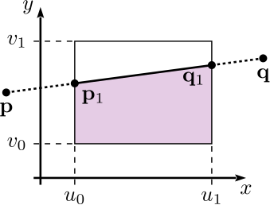
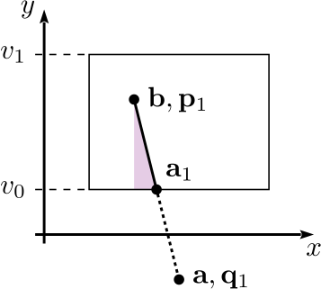

= 2D Graphics Algorithms
Jonathan Merritt
:stem: latexmath

++++

++++

== Area Below a Line Segment

The area below a line segment that intersects with a rectangle can be used as
part of a larger algorithm to find the fraction of a pixel covered by a polygon.
This will be used for computing a stencil in a classic stencil-and-cover
rendering approach. This section describes a fast, simple algorithm for
computing the area. It is suitable for implementation in graphics hardware.

When devising an algorithm for this task, one problem that appears early is the
proliferation of configurations of the line segment and rectangle. When we
consider all the ways the line can be drawn relative to the rectangle, and all
the resulting intersections, there are tens of possible configurations. This is
too many to begin analysing. Consequently, the approach we take here involves
conditioning the line segment at each step, so that we reduce the number of
possible cases. Ultimately just a few possibilities exist at each stage, making
the analysis tractable.

=== Mathematical Outline

First, the line segment will be defined by end points stem:[\mathbf{p} = (p_x,
p_y)] and stem:[\mathbf{q} = (q_x, q_y)], such that stem:[p_x < q_x] (strictly
less than). If stem:[p_x = q_x] then the line segment has no projected area and
can be discarded; alternatively it can proceed through the rest of this
processing with the ordering of points having no impact. The rectangle shall be
aligned with Cartesian axes, extending from stem:[u_0] to stem:[u_1] along the
stem:[x]-axis, and from stem:[v_0] to stem:[v_1] along the stem:[y]-axis.

[#line-seg-definition]
.A line segment definition and the desired "area beneath" it in the rectangle.

After ordering the ends according to their stem:[x] coordinates, we can define
the gradient of the line, stem:[m]:

[stem]
++++
m = \frac{q_y - p_y}{q_x - p_x}
++++

Next trim the line segment to the vertical lines at stem:[u_0] and stem:[u_1],
producing points stem:[\mathbf{p}_1] and stem:[\mathbf{q}_1]. If the line
segment lies completely to the left or right of the rectangle, then both points
are placed at the special coordinates stem:[(u_0, v_0)]. Alternatively, the line
segment may be discarded in these cases. If the line segment does not cross the
rectangle boundaries then no trimming is necessary.

[stem]
++++
\begin{align}
  \mathbf{p}_1 &=
    \begin{cases}
      \displaystyle(u_0, v_0), &
        \text{if } p_x \geq u_1 \text{ or } q_x \leq u_0 \\
      \displaystyle\mathbf{p}, & \text{if } p_x \geq u_0 \\
      \displaystyle\left(
        u_0,
        m\left(u_0 - p_x\right) + p_y
      \right)& \text{otherwise}
    \end{cases}\\
  \mathbf{q}_1 &=
    \begin{cases}
      \displaystyle(u_0, v_0), &
        \text{if } p_x \geq u_1 \text{ or } q_x \leq u_0 \\
      \displaystyle\mathbf{q}, & \text{if } q_x \leq u_1 \\
      \displaystyle\left(
        u_1,
        m\left(u_1 - p_x\right) + p_y
      \right)& \text{otherwise}
    \end{cases}
\end{align}
++++

A line segment that spans a rectangle from left to right is shown below, with
the corresponding trimming to stem:[\mathbf{p}_1] and stem:[\mathbf{q}_1].

[#trim-vertical]
.Trimming the line segment to the rectangle vertically.

Next, we sort the points according to their stem:[y] coordinates, and define
points stem:[\mathbf{a} = (a_x, a_y)] and stem:[\mathbf{b} = (b_x, b_y)], such
that stem:[a_y \leq b_y]:

[stem]
++++
(\mathbf{a}, \mathbf{b}) =
  \begin{cases}
    (\mathbf{p}_1, \mathbf{q}_1), & \text{if } p_{1y} < q_{1y} \\
    (\mathbf{q}_1, \mathbf{p}_1) & \text{otherwise}
  \end{cases}
++++

Following this, we trim the line segment horizontally to the bottom of the
rectangle, at stem:[v_0], to produce point stem:[\mathbf{a}_1]. Again, if the
segment does not cross the bottom border then no trimming is necessary. If the
line segment lies completely below the rectangle then it can either be discarded
or stem:[\mathbf{a}_1] is placed at stem:[\mathbf{b}].

[stem]
++++
\mathbf{a}_1 =
  \begin{cases}
    \displaystyle\mathbf{b}, & \text{if } b_y \leq v_0 \\
    \displaystyle\left(
      a_x, v_1
    \right), & \text{if } a_y \geq v_1 \\
    \displaystyle\mathbf{a}, & \text{if } a_y \geq v_0 \\
    \displaystyle\left(
      \frac{v_0 - p_{1y}}{m} + p_{1x}, v_0
    \right) & \text{otherwise}
  \end{cases}
++++

Another example line segment is shown below with points stem:[\mathbf{a}_1],
stem:[\mathbf{a}], stem:[\mathbf{b}], stem:[\mathbf{p}_1] and
stem:[\mathbf{q}_1] labelled.

[#trim-horizontal]
.Trimming the line segment to the lower edge of the rectangle.

Then we intersect (but don't trim) the line segment to the top of the rectangle
at stem:[v_1], producing point stem:[\mathbf{b}_1]. If the line segment lies
completely above the rectangle then stem:[\mathbf{b}_1 = (a_{1x}, v_1)].

[stem]
++++
\mathbf{b}_1 =
  \begin{cases}
    \displaystyle\left(a_{1x}, v_1\right) & \text{if } a_{1y} \geq v_1 \\
    \displaystyle\mathbf{b}, & \text{if } b_y \leq v_1 \\
    \displaystyle\left(
      \frac{v_1 - p_{1y}}{m} + p_{1x}, v_1
    \right) & \text{otherwise}
  \end{cases}
++++

The final point to be generated is stem:[\mathbf{g}], found by projecting
stem:[\mathbf{b}] downward or upward to the top of the rectangle at stem:[v_1].

[stem]
++++
\mathbf{g} =
  \left(
    b_x, v_1
  \right)
++++

These points are shown in an interactive diagram below. The points at the ends
of the line can be dragged to visualize the computed area.

++++

<canvas id="demo-line-rect" width="400" height="400">
  JavaScript example of line-rectangle area-beneath computation.
</canvas>

++++

After computing the points, the desired area is given by:

[stem]
++++
A =
  \frac{1}{2}(a_{1y} + b_{1y})|a_{1x} - b_{1x}| +
    (v_1 - v_0)|g_{x} - b_{1x}|
++++

=== Branchless Algorithm

The steps above can be expressed in a static-single-assignment, branchless
algorithm for the area as follows:

[source]
----
rectAreaBelow(px, py, qx, qy, u0, u1, v0, v1):
  -- gradient --
  m := (qy - py) / (qx - px)

  -- p1, q1 --
  -- branch factors
  b1 := min((px >= u1) + (qx <= u0), 1)
  b2 := (px >= u0)
  b3 := 1 - min(b1 + b2, 1)
  b4 := (qx <= u1)
  b5 := 1 - min(b1 + b4, 1)
  -- values
  p1x := (b1 + b3) * u0 + b2 * px
  p1y := b1 * v0 + b2 * py + b3 * (m * (u0 - px) + py)
  q1x := b1 * u0 + b4 * qx + b5 * u1
  q1y := b1 * v0 + b4 * qy + b5 * (m * (u1 - py) + py)

  -- a, b --
  -- branch factors
  b6 := (p1y < q1y)
  b7 := 1 - b6
  -- values
  ax := b6 * p1x + b7 * q1x
  ay := b6 * p1y + b7 * q1y
  bx := b6 * q1x + b7 * p1x
  by := b6 * q1y + b7 * p1y

  -- a1 --
  -- branch factors
  b8  := (by <= v0)
  b9  := (ay >= v1)
  b10 := (ay >= v0)
  b11 := 1 - min(b8 + b9 + b10, 1)
  -- values
  a1x := b8 * bx + (b9 + b10) * ax + b11 * ((v0 - p1y) / m + p1x)
  a1y := b8 * by + b9 * v1 + b10 * ay + b11 * v0

  -- b1 --
  -- branch factors
  b12 := (a1y >= v1)
  b13 := (by <= v1)
  b14 := 1 - min(b12 + b13, 1)
  -- values
  b1x := b12 * a1x + b13 * bx + b14 * ((v1 - p1y) / m + p1x)
  b1y := b12 * v1 + b13 * by + b14 * v1

  -- area --
  area := 0.5 * (a1y + b1y) * abs(a1x - b1x) + (v1 - v0) * abs(bx - b1x)

  return area
----
