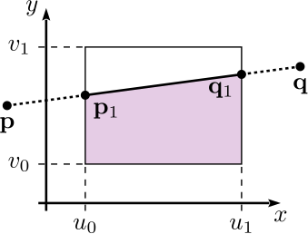

= 2D Graphics Algorithms
Jonathan Merritt
:stem: latexmath

++++

++++

== Area Below a Line Segment

The area below a line segment can be used as part of a larger algorithm to find
the fraction of each pixel covered by a polygon. This section describes a fast,
simple algorithm for computing the area. It is suitable for implementation in
graphics hardware.

When devising an algorithm for this task, one problem that appears early is the
proliferation of configurations of the line segment and rectangle. When we
consider all the ways the line can be drawn relative to the rectangle, and all
the resulting intersections, there are tens of possible configurations. This is
too many to begin analysing. Consequently, we start by conditioning the line
segment in such a way that the number of possible cases are reduced to just a
handful, so that they are more tractable to consider.

First, the line segment will be defined by end points stem:[\mathbf{p} = (p_x,
p_y)] and stem:[\mathbf{q} = (q_x, q_y)], such that stem:[p_x < q_x] (strictly
less than). If stem:[p_x = q_x] then the line segment has no projected area and
can be discarded. The rectangle shall be aligned with Cartesian axes, extending
from stem:[u_0] to stem:[u_1] along the stem:[x]-axis, and from stem:[v_0] to
stem:[v_1] along the stem:[y]-axis.

[#line-seg-definition]
.A line segment definition and the desired "area beneath" it in the rectangle.
image::img/lineSegDefinition.svg[Line Segment,300,align="center"]

After ordering the ends according to their stem:[x] coordinates, we can define
the gradient of the line, stem:[m]:

[stem]
++++
m = \frac{q_y - p_y}{q_x - p_x}
++++

Next trim the line segment to the vertical lines at stem:[u_0] and stem:[u_1],
producing points stem:[\mathbf{p}_1] and stem:[\mathbf{q}_1].

[stem]
++++
\begin{align}
  \mathbf{p}_1 &=
    \begin{cases}
      \displaystyle\mathbf{p}, & \text{if } p_x \geq u_0 \\
      \displaystyle\left(
        u_0,
        m\left(u_0 - p_x\right) + p_y
      \right)& \text{otherwise}
    \end{cases}\\
  \mathbf{q}_1 &=
    \begin{cases}
      \displaystyle\mathbf{q}, & \text{if } q_x \leq u_1 \\
      \displaystyle\left(
        u_1,
        m\left(u_1 - p_x\right) + p_y
      \right)& \text{otherwise}
    \end{cases}
\end{align}
++++

Another example line segment with the trimming to stem:[\mathbf{p}_1] and
stem:[\mathbf{q}_1] is shown below.

[#pq-prime]
.Trimming the line segment to the rectangle vertically.

